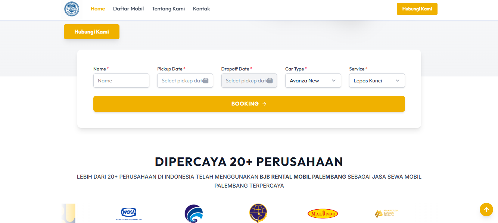
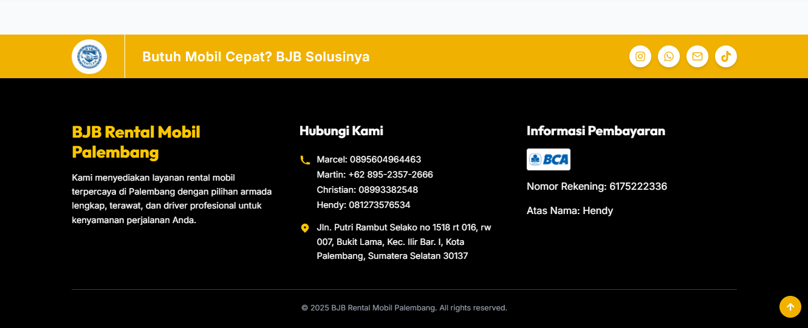

# 🚗 BJB RENTCAR PALEMBANG Website

Proyek _website_ ini dibuat menggunakan **React + TypeScript + Vite** untuk menyediakan platform _online_ yang informatif dan mudah digunakan bagi pelanggan BJB Rentcar Palembang.

---

## 🌟 Fitur Utama

- **Desain Responsif:** Warna dominan **Kuning** sesuai permintaan.
- **Halaman Lengkap:** Beranda, Tentang Kami (Visi & Misi), Daftar Armada, Galeri, FAQ, dan Kontak.
- **Daftar Armada:** Menampilkan detail mobil (tahun, transmisi, kapasitas, kategori) dan tombol _booking_ langsung ke WhatsApp.
- **Informasi Kontak & Sosial Media:** Terintegrasi dengan Peta (**Leaflet**), No. Telp, WhatsApp, Email, dan Social Media (Instagram, TikTok).
- **Footer Informatif:** Detail kontak lengkap, alamat kantor, dan informasi rekening bank.

---

## 🛠️ Stack Teknologi

- **Framework:** React
- **Bahasa:** TypeScript
- **Build Tool:** Vite
- **Peta:** Leaflet (untuk menampilkan lokasi kantor)
- **Hosting:** Vercel (disarankan)

---

## 📁 Foto

---
